# Duskbox screenshots

Real VS Code renders of every variant, captured from the local code-server lab with Playwright. The PNGs live in [`docs/img/shots/`](./img/shots/) and are collected here so the root README can stay focused.

Regenerate them with:

```sh
# terminal 1: build + package + install the local VSIX, serve on :8089
lab/up.sh

# terminal 2: capture the docs gallery from sample.tsx
cd lab
DUSKBOX_LAB_DOCS=1 npm run shoot
```

- Back to the [main README](../README.md)
- Screenshot tool: [`lab/up.sh`](../lab/up.sh) + [`lab/shoot.mjs`](../lab/shoot.mjs)

## Core variants

### dawn

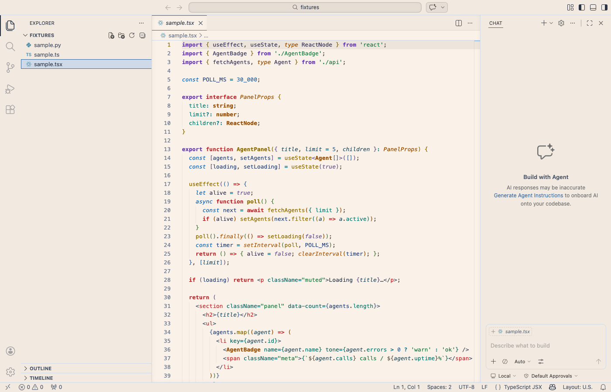

### day

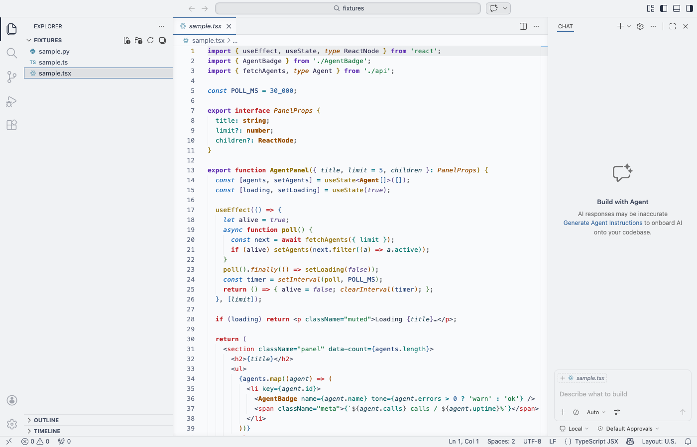

### day-hc

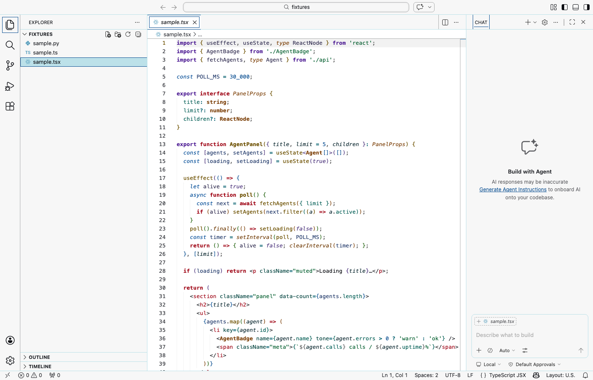

### storm

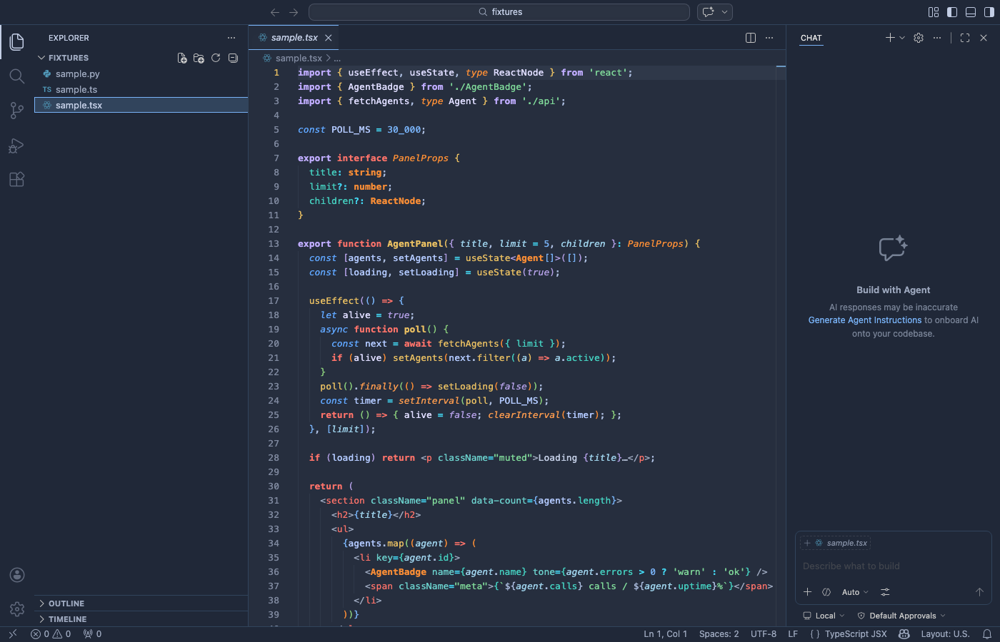

### dusk


### midnight

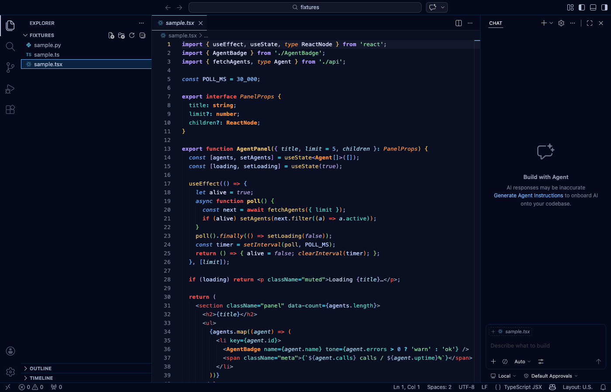

### night-hc

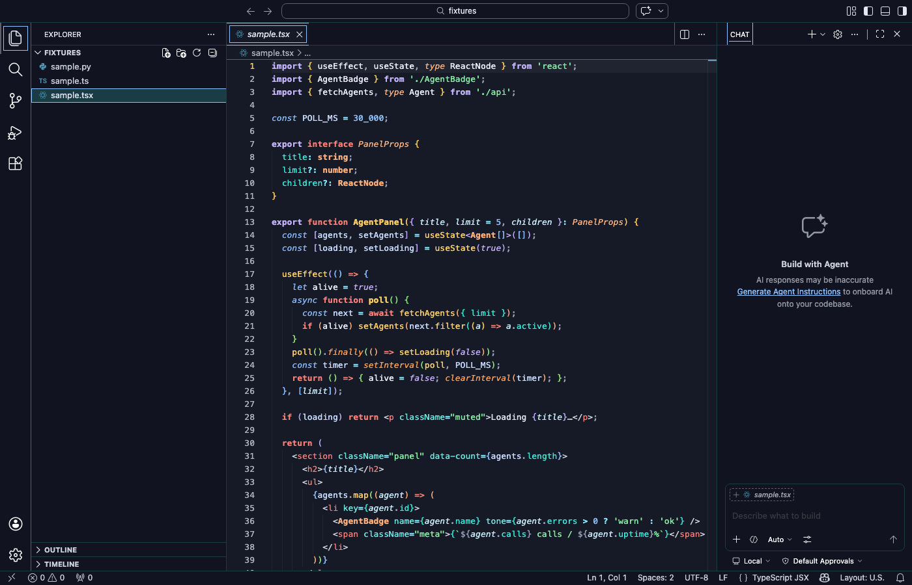

### cyber

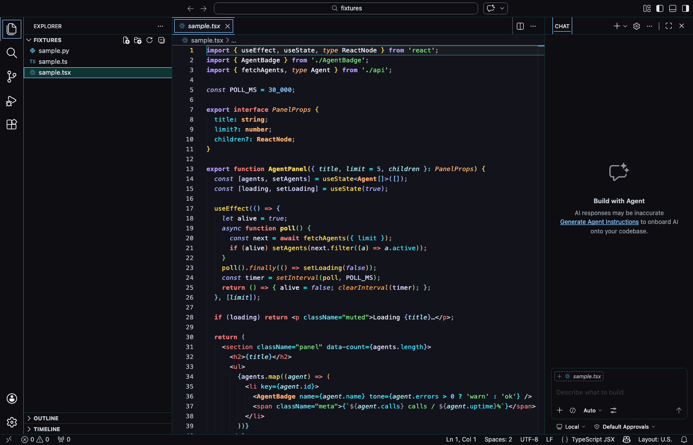

## Signature variants

### dusk-azure

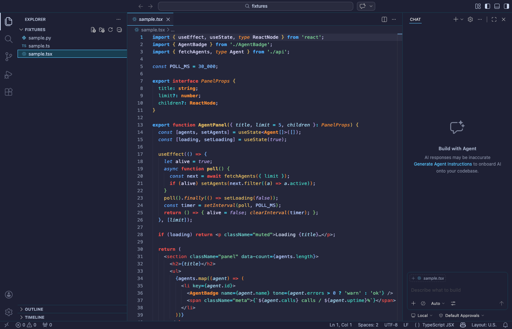

### dusk-neon-purple

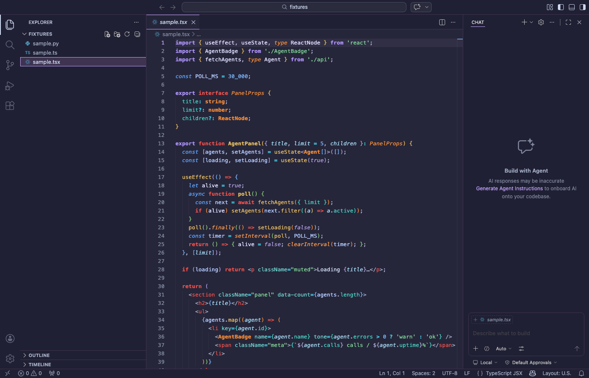

### dusk-magenta

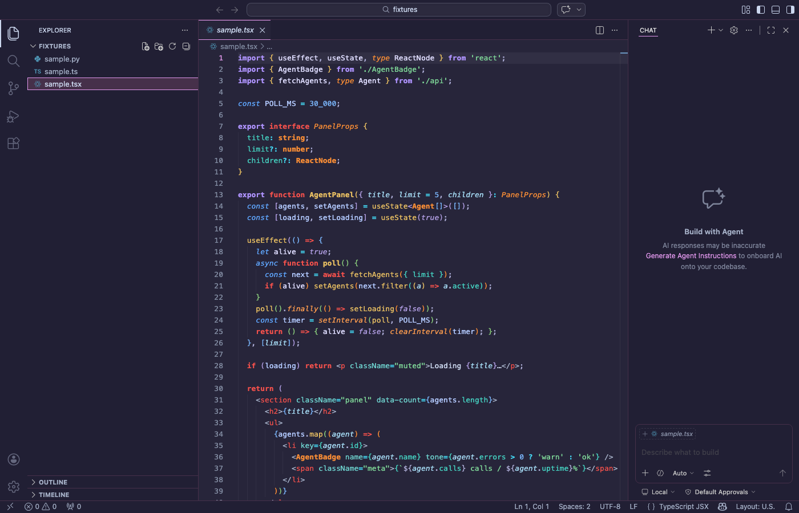

### dusk-salmon

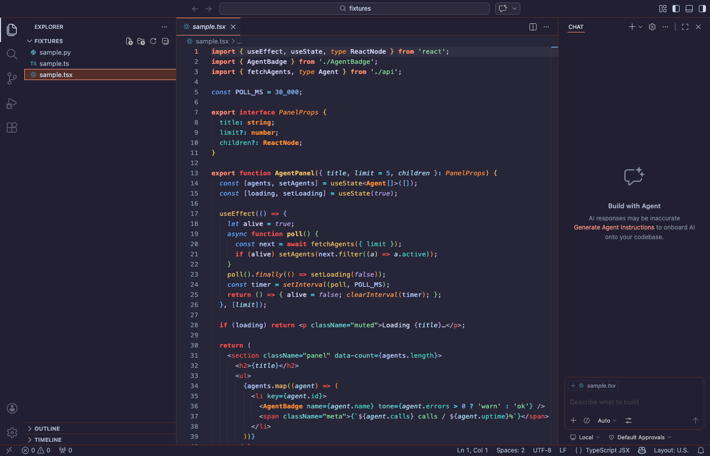

### cyber-azure


### cyber-neon-purple

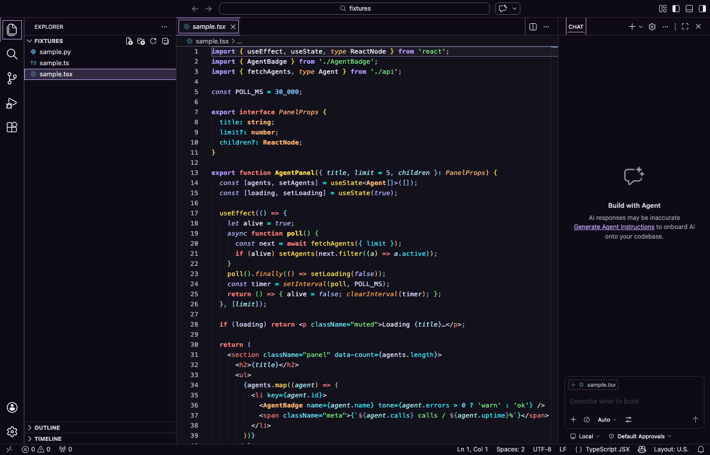

### cyber-magenta

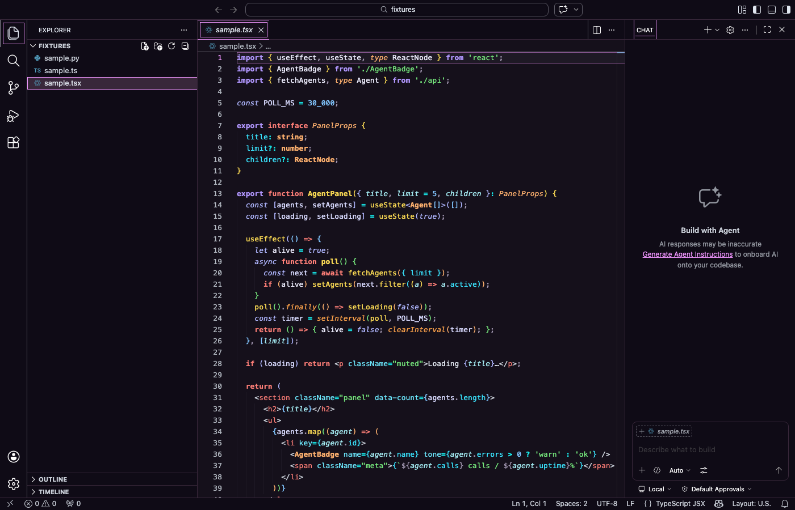

### cyber-salmon


